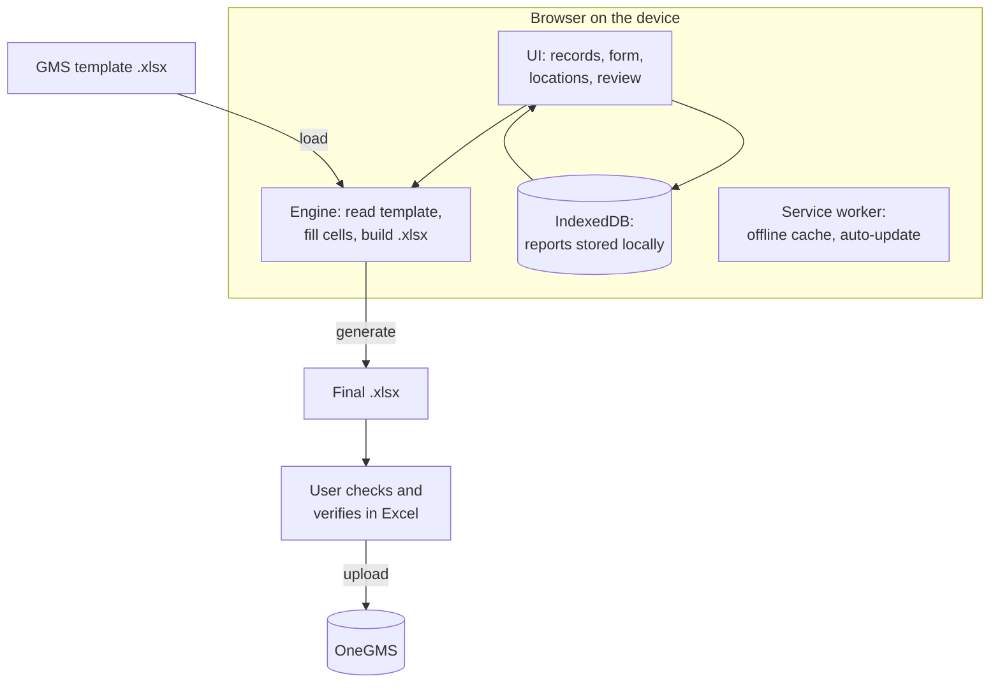

# Architecture

Everything runs in the browser on the device.

- **UI**: the records home, the step-by-step form, the project (locations) view, and the consolidation review.
- **Engine**: reads field values, dropdowns and tables from the loaded template, and writes answers back into the original file, unchanged except for the filled cells.
- **IndexedDB**: keeps every report on the device so it can be reopened without the original file.
- **Service worker**: makes the app work offline and applies updates automatically.
- Before upload, the user opens the generated file in Excel to check and verify it.

See also: [data model](data-model.md), [data flow](data-flow.md).
