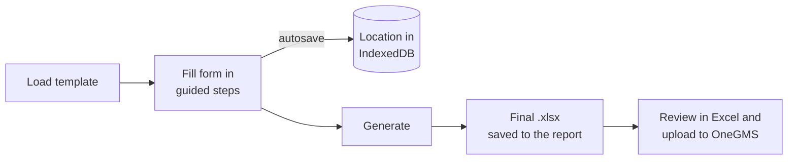
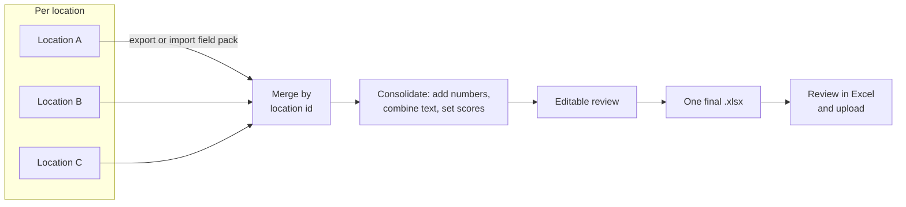
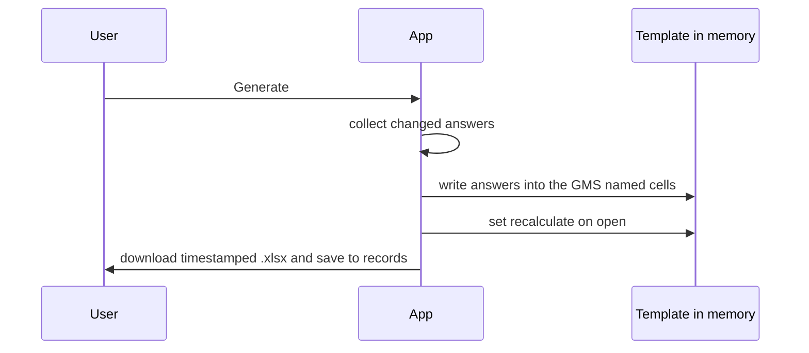

# Data flow

## Single location

## Multiple locations

Different team members fill different locations, optionally on different devices, then one person consolidates.

Aggregation is computed on demand from the locations; the per-location data is never overwritten, and review edits are kept as an override on the project.

## Filling the Excel

The app changes only the cells you fill; everything else in the template is preserved.

See also: [data model](data-model.md), [deployment](deployment.md).
