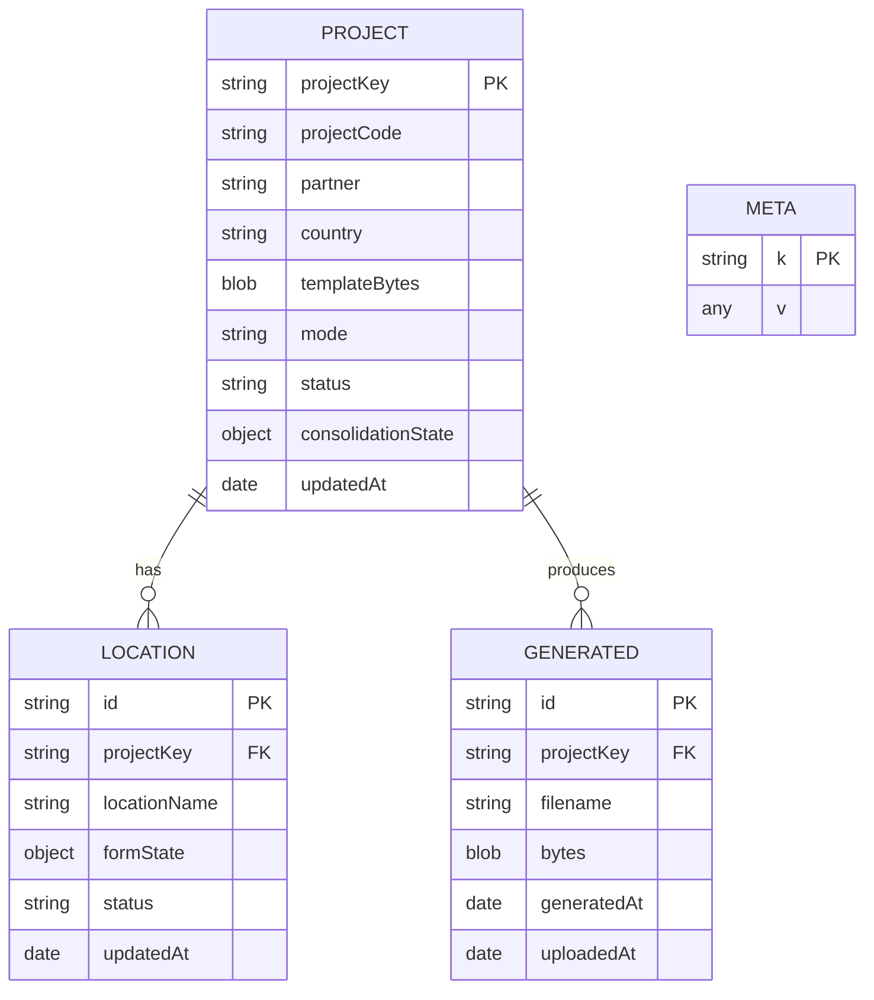

# Data model

Stored in IndexedDB on the device. One project per monitoring report; a project has one or more locations and any number of generated files.

- A **project** holds the template and the report details. `projectKey` is the project code plus a hash of the template, so the same export always maps to the same project. `mode` is single or multi; `consolidationState` keeps the review edits.
- A **location** holds one site's answers in `formState`. Single-location reports have one location; multi-location reports have several, each with a stable `id` used to merge contributions. `status` is planned, draft or complete.
- **generated** keeps each final Excel with timestamps; `uploadedAt` is set when the user marks it uploaded.
- **meta** is small app settings.

See also: [data flow](data-flow.md).
