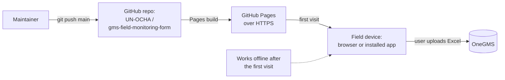

# Deployment

- Hosted on GitHub Pages; pushing to `main` redeploys.
- The first visit must be online; after that the app runs offline and can be installed to the home screen.
- All data stays on the device. The only things that cross the network are loading the app and the user's own upload to OneGMS.

See also: [architecture](architecture.md).
